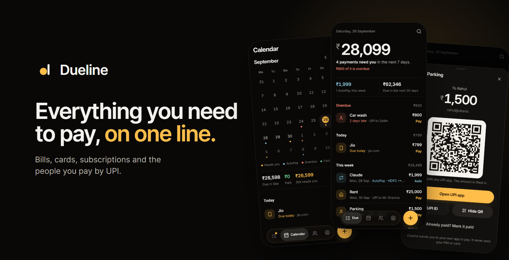
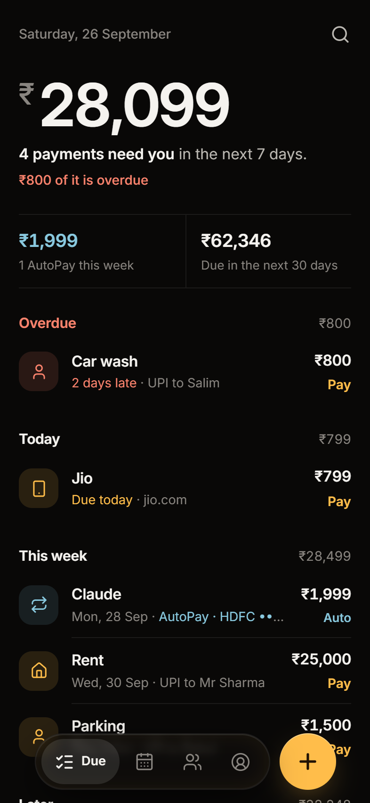
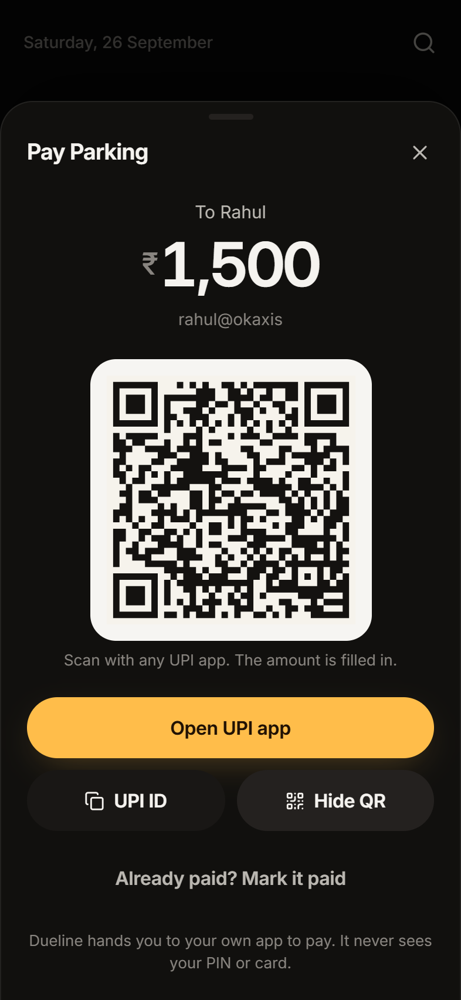
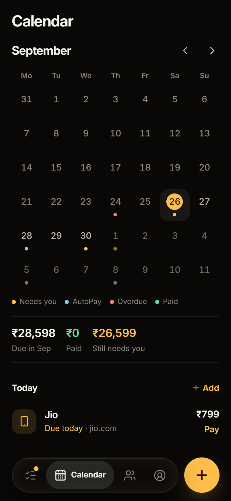
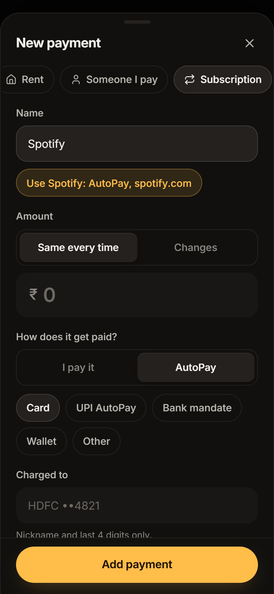
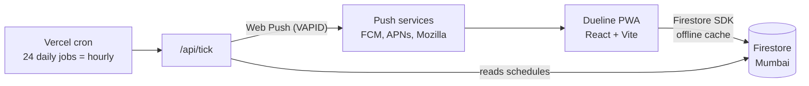

<p align="center">
  
</p>

<p align="center">
  <strong>Card bills, rent, subscriptions and the people you pay by UPI, on one calm timeline.</strong><br>
  See what needs you, what AutoPay already has covered, and get to the payment in one tap.
</p>

<p align="center">
  <a href="https://dueline-app.web.app"><strong>Open Dueline</strong></a>
  &nbsp;·&nbsp;
  <a href="#features">Features</a>
  &nbsp;·&nbsp;
  <a href="#how-it-works">How it works</a>
  &nbsp;·&nbsp;
  <a href="#run-it-locally">Run it locally</a>
</p>

<p align="center">
  
  
  
  
</p>

## Why Dueline

Most bill apps count your bills. Dueline answers one question: **what needs me, and when?**

A credit-card bill, the parking attendant you pay by UPI, a Netflix subscription that renews on its own and a 28-day phone recharge are the same thing to Dueline: money that has to leave you by a date, through some route, unless something is already handling it. Everything lands on one timeline, split into what needs you and what AutoPay has covered, and every payment knows its next action.

Dueline never moves money. It hands you to your own UPI app, bank or biller, then asks whether it went through.

## Screenshots

<table>
  <tr>
    <td align="center"><br><sub>What needs you this week</sub></td>
    <td align="center"><br><sub>UPI with the amount filled in</sub></td>
    <td align="center"><br><sub>Every due date at a glance</sub></td>
    <td align="center"><br><sub>One sheet to add anything</sub></td>
  </tr>
</table>

## Features

- **Needs you, or handled.** The headline number is only what needs you in the next 7 days. AutoPays sit in their own quieter colour.
- **Expected is not confirmed.** When an AutoPay date passes, Dueline asks whether it went through. If a week goes by without an answer it stops asking and marks it assumed, never paid: assumed AutoPays stay out of paid totals and history, and one tap still confirms or flags them.
- **Pay in one tap.** UPI opens your UPI app with the payee and amount filled in, a laptop shows a QR code, bills open the biller's page, cash is one tap to mark paid.
- **Real Indian schedules.** Monthly (including the last day of the month), quarterly, yearly, every N days for 28-day recharges, and EMIs that end after a set number of payments.
- **Bills that change.** Card and electricity bills carry an estimate until the real amount arrives.
- **Calm reminders.** A morning reminder, an evening nudge only if something due today is still unpaid, a few overdue nudges, then quiet. Three or more at once arrive as one notification.
- **Works offline.** An installable PWA with a local-first cache: add, pay and undo on a train, and it syncs later.
- **Recognisable at a glance.** Spotify, Claude, Netflix, Jio and thirty-odd other services show their own mark, drawn in Dueline's state colours and bundled with the app, so no icon service learns what you subscribe to. Everyday payments get a matching icon from the words people use for them: parking, the maid, doodh wala, tuition, the gas cylinder.
- **Private by design.** No bank logins, no card numbers, no UPI PIN. Your data is yours: export it, import it into another account, or delete it completely.
- **Sign in your way.** Google first, or email. Or start as a guest and save to an account later without losing anything.

## How it works



- **One model.** An obligation is the template (Parking, ₹1,500, monthly on the 1st). Its dates are computed from the schedule, never stored. A cycle gets its own record only when something happens to it (paid, skipped, moved, amount entered), so editing a schedule never rewrites history.
- **One engine.** `src/core` is plain TypeScript with no dependencies on the browser. The app renders from it and the reminder server plans notifications from it, so what the screen says is due and what you get reminded about cannot drift apart.
- **Reminders for ₹0.** Vercel's free plan allows many cron jobs but runs each once a day, so 24 of them, one per hour, make an hourly reminder tick. Each notice is claimed with a create-only record before it is sent, so a retried tick never sends twice. If the push reaches no device, the claim is released and the next hour tries again.
- **No service-account key.** The server signs in as a single restricted account that the Firestore rules allow to read schedules and write the reminder log, and nothing else.
- **Money is integer paise** and due dates are calendar days in the person's timezone.

## Built with

| Layer | Choice |
|---|---|
| App | React 19, Vite, TypeScript, a hand-written service worker |
| Icons | Lucide, and Simple Icons for service marks (the trademarks belong to their owners) |
| Data | Firebase Authentication and Firestore with offline persistence |
| Reminders | Vercel Functions in Mumbai, `web-push`, Web Push with VAPID |
| Hosting | Firebase Hosting |
| Tests | Vitest, the Firestore emulator, Playwright |

## Run it locally

You need Node 20 or newer, the Firebase CLI, and Java 21 for the emulators.

```bash
git clone https://github.com/TheAlgo7/dueline.git
cd dueline
npm install

# terminal 1: local Firebase
firebase emulators:start --only auth,firestore --project dueline-app

# terminal 2: the app against the emulators
VITE_EMULATORS=1 npm run dev
```

Open http://localhost:5173 and choose **Try it without an account**.

The app is wired to the author's Firebase project. To run your own copy, change the web config in `src/lib/firebase.ts`, the reminder account's uid in `firestore.rules`, and `API_BASE` for your own deployment of the API.

## Tests

| Command | What it covers |
|---|---|
| `npm test` | The engine: recurrence, due states, reminder planning, money and UPI links |
| `npm run test:rules` | Firestore security rules against the emulator |
| `python scripts/qa.py` | 32 scenarios in a real browser: editing, EMIs, undo, AutoPay checks, import, offline sync, accounts, deep links |
| `python scripts/signin-check.py` | Google, guest to Google, phone codes and email |
| `python scripts/redirect-check.py` | Sign-in by redirect, as installed apps use it |

The browser scripts need Python with Playwright and a running dev server and emulators.

## Project structure

```text
src/
  core/        the engine: types, dates, recurrence, timeline, reminders, money, UPI
  lib/         Firebase, store, actions, auth, push, sheets, router
  screens/     Due, Calendar, Payees, You, Welcome
  sheets/      add and edit, payment detail, pay, mark paid, payee, search, history, account
  ui/          dock, rows, controls, sign-in buttons
  sw.js        the service worker
server/        reminder tick and test push (bundled into api/ with esbuild)
api/           generated Vercel functions; edit server/, never api/
tests/         engine and security-rule tests
scripts/       browser checks, icon and screenshot rendering
```

## Deploy

```bash
npm run deploy:web     # build and publish to Firebase Hosting
npm run deploy:rules   # Firestore rules
npm run deploy:api     # bundle server/ and deploy the Vercel functions
```

The API reads `DUELINE_ROBOT_EMAIL`, `DUELINE_ROBOT_PASSWORD`, `VAPID_PUBLIC_KEY`, `VAPID_PRIVATE_KEY`, `VAPID_SUBJECT` and `CRON_SECRET` from its environment. None of them are in this repository.

Every API response carries an `x-dueline-api` header with a hash of the server's sources, and `npm run build:api` prints the hash your working tree would deploy, so you can check what production is running:

```bash
curl -sI https://dueline-api.vercel.app/api/tick | grep x-dueline-api
```

## Privacy and security

- Every document lives under its owner's account, and the Firestore rules let no one else read it.
- Dueline stores no card numbers, bank credentials or UPI PINs, only what you type, like "HDFC ••4821".
- Pushes carry only what the notification shows.
- Export gives you everything as JSON; deleting your account removes every record, then the login.

## Licence

Copyright © 2026 Gaurav Kumar, [The Algothrim](https://thealgothrim.com). All rights reserved.

The code is public to read and learn from. It is not licensed for reuse.
